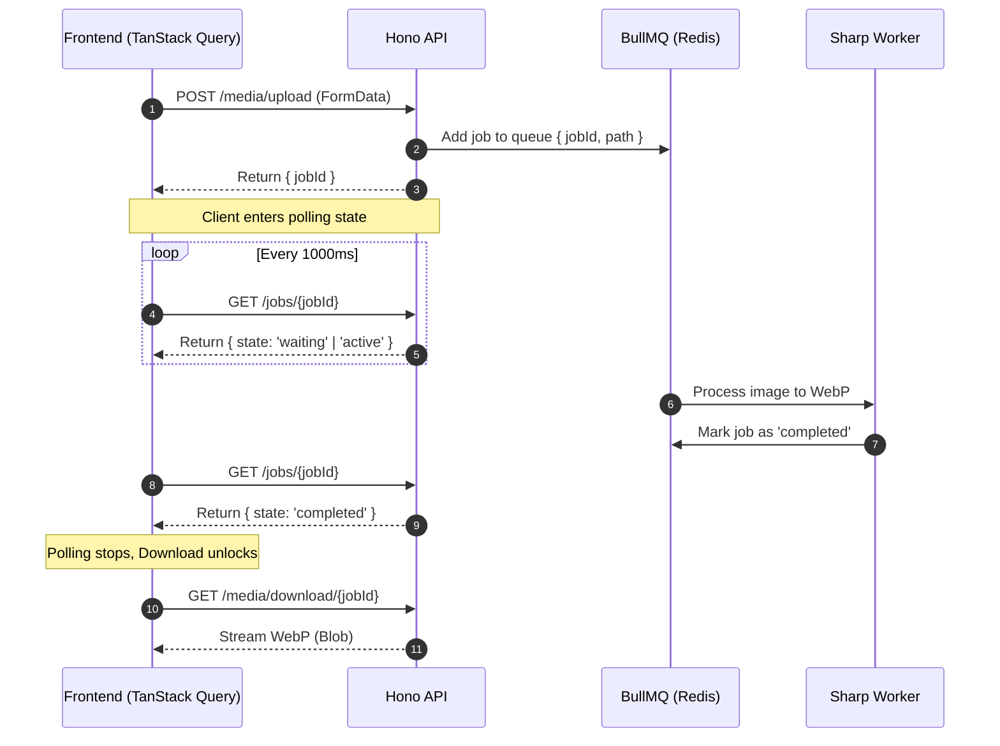

# 🍊 Squish!

Squish is a highly responsive, asynchronous image compression pipeline. It provides a seamless user experience for uploading, compressing, and downloading WebP images without blocking the main browser thread or timing out HTTP requests.

## 🚀 Brief Intro

Squish solves the classic problem of heavy image processing on the web. Instead of forcing the user to wait on a single, long-running HTTP request (which can time out or degrade server performance), Squish utilizes a distributed queue architecture. The frontend orchestrates the flow using synthetic promises and polling, resulting in a buttery-smooth UX from drop to download.

## 💻 Tech Stack

### Frontend

- **Core:** React, TypeScript, Vite
- **Routing & State:** TanStack Router, TanStack Query (React Query)
- **UI & Styling:** Mantine, Tailwind CSS, Phosphor Icons, Gooey Toast
- **HTTP Client:** Axios
- **Tooling:** Bun

### Backend

- **API Framework:** Hono
- **Queue System:** BullMQ (backed by Redis)
- **Image Processing:** Sharp
- **Tooling:** Bun

## 🏗️ Architecture

Squish is built on an asynchronous queue-based architecture.

### Why this architecture?

1. **The Node.js Single Thread Problem:** Image compression (via Sharp) is highly CPU-intensive. If we processed images synchronously within the API route, a few concurrent uploads would completely block the Node.js event loop, paralyzing the entire backend.
2. **The HTTP Timeout Problem:** Large files take time to compress. Standard HTTP requests might time out before the server finishes the job.
3. **The Solution (BullMQ + Polling):** By offloading the heavy lifting to a BullMQ worker, the main Hono API remains blazing fast and instantly available. The frontend simply asks for a `jobId` and polls for updates, completely eliminating timeouts and providing real-time UI feedback.

### The Flow

### Frontend Architecture

To keep the React layer clean, the frontend is strictly separated into distinct layers:

- **Transport Layer**: Axios interceptors handle global error catching.
- **API Layer**: Isolated functions for network calls (`uploadImage`, `getJobStatus`, `downloadImage`).
- **Server State Layer**: TanStack Query hooks handle the polling lifecycle and mutations.
- **Business Logic Layer**: A custom useCompressor hook orchestrates synthetic promises (via `goey-toast`), local object URLs, and React state.
- **Presentation Layer**: The view component is purely declarative, rendering Mantine components based on the hook's state.

### Backend Architecture

To ensure the API remains non-blocking and highly maintainable, the backend is strictly divided into functional layers:

- **Controller Layer (Hono)**: Acts as the entry point. It receives HTTP requests, parses FormData, and handles the final HTTP responses.
- **Validation Layer (Zod)**: Enforces strict runtime checks before any logic is executed. It ensures uploaded files exist, match the correct MIME types, and do not exceed the 20MB limit.
- **Service Layer (Hono)**: Contains the core business logic. It handles saving temporary files to the disk, generating unique UUIDs, and acting as the bridge between the controllers and the queue system.
- **Queue Orchestration Layer (BullMQ / Redis)**: Manages the asynchronous job lifecycle. It holds pending jobs in memory, passes them to available workers, and updates job states.
- **Worker & Processing Layer (Sharp)**: The isolated execution environment. It picks up the jobId and file path from BullMQ, compresses the image into WebP format using Sharp, saves the output to the disk, and signals job completion.
